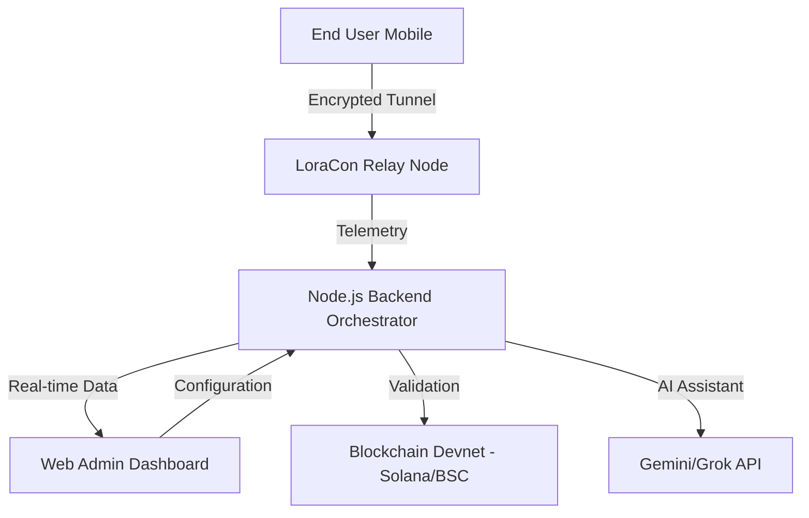

<div align="center">

</div>

# LoraCon: Enterprise VPN Infrastructure Suite 🛡️

> **A professional-grade, decentralized VPN solution with multi-chain billing, advanced cryptography, and real-time infrastructure orchestration.**

## 📋 Project Overview

LoraCon is a complete ecosystem for secure, decentralized tunneling with:
- **Android Mobile Client** - Native Kotlin app for mobile VPN access
- **Web Admin Portal** - React + Vite frontend with cybernetic UI
- **Node.js Backend API** - Secure middleware orchestrator
- **Global Relay Network** - 60+ decentralized nodes across multiple regions

**Status:** Production-ready | **License:** MIT | **Maintainer:** Lorapok Labs

---

## 🏛️ Architecture Overview



---

## 🌐 Core Components

### 1️⃣ **Mobile Client** (Kotlin)
Located in: Project root directory
- Native Android application
- WireGuard & OpenVPN integration
- Military-grade AES-256 encryption
- Perfect forward secrecy (PFS)
- No-logs policy enforcement

**Setup:**
1. Open Android Studio
2. Load project directory
3. Configure `.env` with `GEMINI_API_KEY`
4. Remove debug signing config from `build.gradle.kts`
5. Deploy to emulator or physical device

### 2️⃣ **Web Suite** (Vite + React + Tailwind)
Located in: `web_admin_panel/frontend`

#### **Landing Page** (`src/pages/LandingPage.jsx`)
- Cybernetic product showcase
- Three pricing tiers with blockchain integration
- Interactive VPN demo (real-time connection simulator)
- Multi-chain payment checkout (Solana/BSC)
- Wishlist protocol for alpha testers

#### **Admin Dashboard** (`src/App.jsx`)
- Real-time bandwidth telemetry
- Node cluster management
- Payment verification interface
- API health monitoring
- Session tracking & user management

**Features:**
- Framer Motion animations
- Recursive API polling for health checks
- AnimatePresence for smooth route transitions
- Tailwind CSS with custom neon styling

### 3️⃣ **Backend API** (Node.js)
Located in: `web_admin_panel/backend`

**Responsibilities:**
- Centralized API key management (Gemini, Grok)
- Secure wallet integration (Phantom, Binance Wallet)
- Transaction verification (Solana/BSC)
- Node orchestration & deployment
- Session management & telemetry

**Environment Variables Required:**
- `GEMINI_API_KEY` - Google Gemini AI integration
- `GROK_API_KEY` - xAI Grok integration
- `SOLANA_RPC_URL` - Solana network endpoint
- `BSC_RPC_URL` - Binance Smart Chain endpoint

---

## 💳 Multi-Chain Billing System

### Supported Networks
- **Solana**: SOL, USDC, USDT, utility tokens
- **Binance Smart Chain (BSC)**: BNB, USDT, USDC, CAKE

### Pricing Tiers

| Plan | Price | Features |
|------|-------|----------|
| **Protocol Stealth** | 0.5 SOL | Single node, 100GB cap, standard encryption |
| **Protocol Warp** | 1.2 SOL | Multi-hop routing, unlimited bandwidth, AI routing |
| **Sentinel Prime** | 2.5 SOL | Dedicated mesh, traffic mimicry, 24/7 support |

### Payment Flow
1. **User Initialization** → Clicks "Secure Subscription" from pricing cards
2. **Wallet Connection** → Connects Phantom/Binance Wallet
3. **Asset Selection** → Chooses payment network (SOL/BNB) and asset
4. **Direct Transfer** → Sends payment to escrow wallet address
5. **Verification** → 
   - Automatic: System monitors blockchain for transfers (simulated in devnet)
   - Manual: Users can submit transaction hash
6. **Approval** → Admin verifies payment and issues encrypted VPN Privilege Keys

---

## 🛠️ Technical Standards

### UI/UX Design
- **Organism-inspired Cybernetic** aesthetic
- High-contrast neon-on-carbon layouts
- Monospace typography for technical readouts
- Smooth Framer Motion transitions

### Communication Layer
- **Centralized Service**: `web_admin_panel/frontend/src/services/api.js`
- **Axios Instance** for all HTTP requests
- **Recursive Polling** via `setTimeout` for health checks
- Environment-based API routing via `VITE_API_BASE_URL`

### Performance
- Recursive polling prevents request stacking during high latency
- AnimatePresence ensures smooth modal/route transitions
- SVG waveforms for real-time telemetry visualization
- Optimized component re-renders with Framer Motion

---

## 🚀 Deployment Guide

### Prerequisites
- Node.js 18+
- Vite 5+
- React 18+
- Git & GitHub CLI

### Local Development

#### 1. Setup Frontend
```bash
cd web_admin_panel/frontend
npm install
cp .env.example .env.local
# Update VITE_API_BASE_URL=http://localhost:5000
npm run dev
```

#### 2. Setup Backend
```bash
cd web_admin_panel/backend
npm install
cp .env.example .env
# Add GEMINI_API_KEY, GROK_API_KEY, chain RPCs
npm start
```

#### 3. Setup Android
```bash
# Open project in Android Studio
# Configure .env with GEMINI_API_KEY
# Run on emulator or device
```

### Production Deployment

#### **GitHub Pages (Frontend)**
The project uses automated CI/CD via GitHub Actions (`.github/workflows/deploy-web-admin.yml`)

**Configuration:**
1. Go to repository **Settings** → **Secrets and variables** → **Actions**
2. Add secret: `VITE_API_BASE_URL` 
3. Set value to your backend API URL (e.g., `https://your-backend.onrender.com`)
4. Push to `main` branch → Automatic deployment to `https://mrhellbooy.github.io/LoraCon/`

#### **Backend Service (Render/Railway)**
1. **Connect Repository** to Render or Railway
2. **Configure:**
   - Build Command: `cd web_admin_panel/backend && npm install`
   - Start Command: `npm start`
   - Root Directory: `web_admin_panel/backend`
3. **Environment Variables:**
   - `GEMINI_API_KEY`
   - `GROK_API_KEY`
   - `SOLANA_RPC_URL`
   - `BSC_RPC_URL`
4. **Deploy** → Get production URL
5. **Update GitHub secret** `VITE_API_BASE_URL` with production backend URL

---

## 📁 Project Structure

```
LoraCon/
├── android-app/                          # Kotlin mobile client
│   └── src/                             # Android source code
├── web_admin_panel/                      # Web infrastructure suite
│   ├── frontend/                        # React + Vite + Tailwind
│   │   ├── src/
│   │   │   ├── pages/
│   │   │   │   ├── LandingPage.jsx      # Main landing & pricing
│   │   │   │   └── AdminPanel.jsx       # Dashboard
│   │   │   ├── components/              # Reusable UI components
│   │   │   ├── services/
│   │   │   │   └── api.js               # Centralized Axios layer
│   │   │   └── App.jsx                  # Main app component
│   │   ├── .env.example
│   │   └── package.json
│   └── backend/                         # Node.js API server
│       ├── server.js                    # Entry point
│       ├── routes/                      # API endpoints
│       └── package.json
├── .github/
│   └── workflows/
│       └── deploy-web-admin.yml         # CI/CD pipeline
├── INSTRUCTIONS.md                       # Developer guidelines
├── PROJECT_CONTEXT.md                    # Architecture docs
├── README.md                            # This file
└── LICENSE                              # MIT License
```

---

## 🔐 Security Features

✅ **Encryption**
- AES-256 bit encryption
- ChaCha20-Poly1305 AEAD cipher
- Curve25519 ephemeral key exchange
- Perfect forward secrecy (PFS)

✅ **Privacy**
- Strict no-logs policy
- Solana-based transparency audits
- WebRTC leak protection
- DNS leak prevention

✅ **Backend Security**
- API key centralization (no client-side credentials)
- Secure wallet handshakes
- Transaction verification protocols
- Rate limiting & request throttling

---

## 🧪 Testing & Verification

### Admin Dashboard Testing
1. Navigate to `https://mrhellbooy.github.io/LoraCon/admin`
2. Test tabs: FLOW & API, CRYPT VALUATION, NODES BUILD, GRAPH MONITOR
3. Configure bandwidth limits, pricing, and node management

### Payment Flow Testing
1. Click "Secure Subscription" on any pricing card
2. Select chain (Solana/Binance)
3. Connect wallet (simulated in devnet)
4. Submit transaction hash
5. Verify payment in Admin Panel → Payment Verification tab

### Mobile App Testing
1. Build and run on Android emulator/device
2. Test tunnel connection with real IP detection
3. Verify encryption protocols
4. Monitor bandwidth usage

---

## 📊 Real-Time Monitoring

### Dashboard Metrics
- **Active Nodes**: Real-time cluster status
- **Network Throughput**: SVG waveform visualization
- **Active Sessions**: Connected user telemetry
- **API Health**: Recursive polling status indicator
- **Payment Verification**: Transaction hash lookup

### Telemetry Collection
- Node performance metrics (ping, load, bandwidth)
- User session tracking (IP, platform, protocol)
- Payment transaction history
- System resource utilization

---

## 🤝 API Endpoints

### Admin Configuration
- `GET /api/admin/config` - Fetch system configuration
- `POST /api/admin/config/update` - Update pricing, limits, providers
- `GET /api/admin/sessions` - Get active VPN sessions

### Node Management
- `POST /api/admin/server/add` - Register new relay node
- `DELETE /api/admin/server/delete/:id` - Decommission node

### Payment Verification
- `POST /api/payment/verify` - Verify blockchain transaction
- `GET /api/payment/history` - Get transaction history

---

## 🐛 Known Issues & Fixes

### Issue: Modals Not Opening
**Status:** ✅ FIXED (Commit: `2a4db83`)

**Root Cause:** Modals were not properly guarded with null checks before rendering within AnimatePresence.

**Solution:** Added explicit `if (!isOpen) return null;` conditions to:
- `DownloadModal`
- `WishlistModal`
- `CheckoutModal`

This ensures modals only render when the open state is true.

---

## 📝 Development Guidelines

### Adding New Features
1. Read `/INSTRUCTIONS.md` for API communication patterns
2. Use centralized service layer: `web_admin_panel/frontend/src/services/api.js`
3. Wrap route changes in `AnimatePresence` for smooth transitions
4. Use `lucide-react` for all icons
5. Maintain monospace styling for technical elements

### Code Standards
- **Naming**: PascalCase for components, camelCase for functions
- **State Management**: Use React hooks (useState, useEffect, useContext)
- **Styling**: Tailwind utility-first CSS with custom neon colors
- **Animations**: Framer Motion for all transitions

### Testing Before Deploy
1. Test all modal interactions
2. Verify API connectivity
3. Check payment flow end-to-end
4. Test responsive design (mobile, tablet, desktop)
5. Validate form submissions

---

## 🔄 CI/CD Pipeline

The project uses GitHub Actions for automated deployment:

**Trigger:** Push to `main` branch

**Steps:**
1. Install dependencies
2. Build React app (Vite)
3. Deploy to GitHub Pages
4. Notify deployment status

**Secrets Required:**
- `VITE_API_BASE_URL` - Backend API endpoint

---

## 📞 Support & Contact

- **GitHub Issues**: Report bugs and feature requests
- **Documentation**: See `INSTRUCTIONS.md` and `PROJECT_CONTEXT.md`
- **Email**: lorapokdev@gmail.com

---

## 📄 License

This project is distributed under the **MIT License**. See `LICENSE` file for details.

---

## 🎯 Roadmap

- [ ] Multi-signature wallet support
- [ ] Additional blockchain networks (Polygon, Arbitrum)
- [ ] Advanced analytics dashboard
- [ ] Machine learning-based node optimization
- [ ] Mobile app v2 with enhanced UI
- [ ] Desktop client (Windows/macOS/Linux)

---

**⚡ Last Updated:** 2026-06-16  
**Maintained by:** Lorapok Labs  
**Status:** Production Ready  

*This project is strictly for professional use. All rights reserved by Lorapok Labs.*
