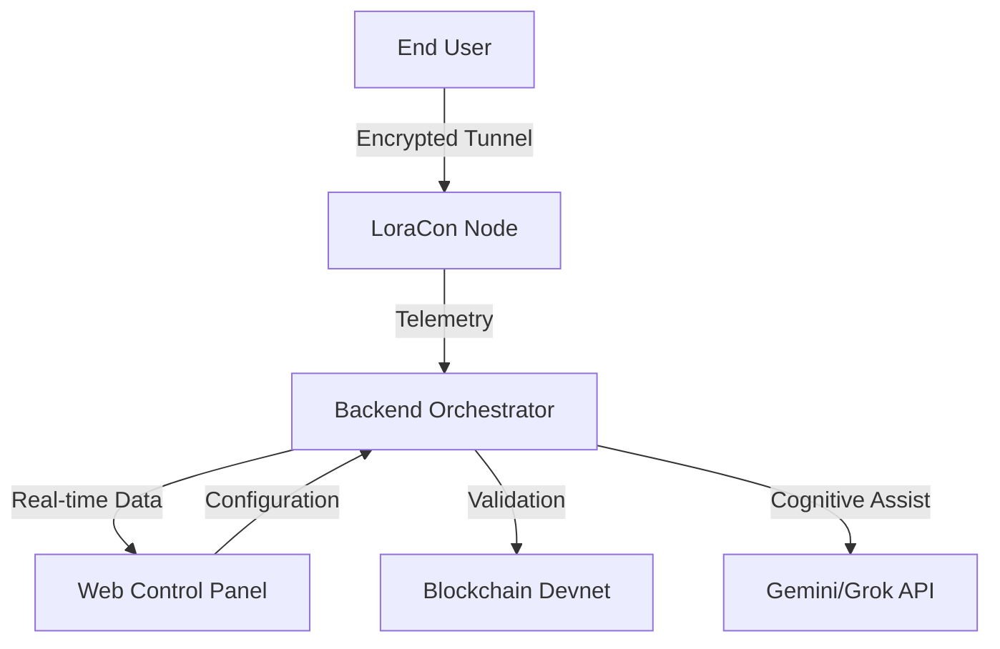

# LoraCon Infrastructure Suite 🛡️

## 🏢 Overview
**LoraCon** is a professional-grade, enterprise-scale secure tunneling solution developed by **Lorapok Labs**. This repository contains the complete administrative control ecosystem designed for high-availability VPN cluster orchestration, real-time telemetry analytics, and decentralized subscription validation.

The suite is characterized by its **Organism-inspired Cybernetic** aesthetic, featuring high-contrast neon-on-carbon layouts and smooth, deliberate transitions.

---

## 🧭 Project Architecture

---

## 🏛️ Components

### 🌐 Web Suite (Vite + React + Tailwind)
The web interface features a centralized **Axios service layer** and **Framer Motion** powered layout transitions:
- **Product Landing Page**: A cybernetic display featuring high-performance asset pairings and modern terminal aesthetics.
- **Super Admin Dashboard**: A high-tech control center featuring real-time bandwidth telemetry, node mapping, and persistent API health monitoring through recursive polling.

### ⚙️ Node.js Backend API
A secure, Node.js-based middleware orchestrator.
- **Security**: Centralizes all API key management (`Grok`, `Gemini`) to prevent client-side credential exposure.
- **Handshakes**: Manages secure connection protocols between the Android client and the node network.
- **Orchestration**: Processes real-time data flow for the administrative dashboard.

---

## 🛠️ Technical Standards

- **Cybernetic UX**: Utilizes custom-styled containers with neon accents and monospace typography for technical readouts.
- **Resilient Communication**: API health is maintained via recursive `setTimeout` polling to ensure UI responsiveness during network latency.
- **Smooth Navigation**: All route changes are handled via `AnimatePresence` for a polished, modern terminal feel.

---

## 🚀 Deployment Methodology

### 1. Web Application Production
Host the frontend (React) on GitHub Pages. The automated CI/CD pipeline handles compilation and deployment via `.github/workflows/deploy.yml`.

### 2. Backend Service
Deploy the Node.js API to a scalable PaaS like **Render** or **Railway**.

1.  **Repository Setup**: Connect your repository to the service.
2.  **Configurations**: 
    -   Root: `web_admin_panel/backend`
    -   Environment: Inject `GEMINI_API_KEY`, and other secrets via the service provider's panel.
3.  **Environment Link**: Point the GitHub environment secret `VITE_API_BASE_URL` to your live backend URL.

---

## ⚖️ License
Distributed under the **MIT License**. See `LICENSE` for more information.

---

## 🤝 Partners & Contributors
*   **Lorapok Labs**: Technical infrastructure and core architecture.
*   **Global Node Network**: Infrastructure for decentralized routing.

---

*This project is strictly for professional use. All rights reserved by Lorapok Labs.*
