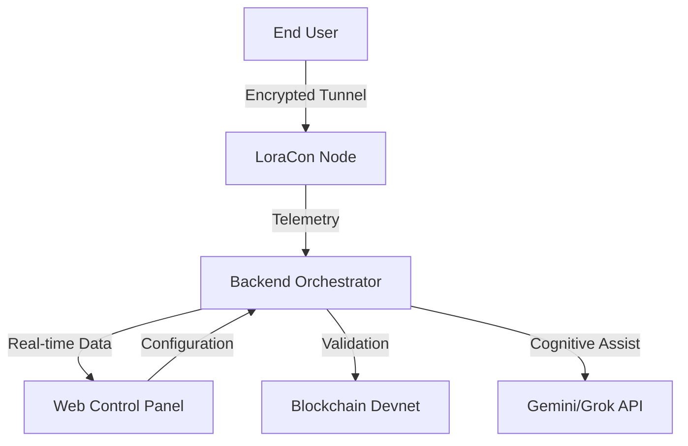

# LoraCon Infrastructure Suite

## 🏢 Overview
LoraCon is a professional-grade, enterprise-scale secure tunneling solution. This repository contains the complete administrative control ecosystem designed for high-availability VPN cluster orchestration, real-time telemetry analytics, and decentralized subscription validation.

**Powered by Lorapok Labs Partners**

---

## 🧭 Project Architecture

---

## 🏛️ Components

### 🌐 Web Suite (React Admin & Product Page)
The web interface consists of:
- **Product Landing/Download Page**: A professional, responsive, research-informed page for users to discover and download LoraCon.
- **Admin Dashboard**: A secure control center to manage node scaling, bandwidth throttling, and API provider switching.

### ⚙️ Node.js Backend API
A secure, Node.js-based middleware orchestrator.
- **Security**: Centralizes all API key management (`Grok`, `Gemini`) to prevent client-side credential exposure.
- **Validation**: Seamlessly validates Solana/USDT subscription payments.
- **Orchestration**: Manages real-time data flow between the Android VPN nodes and the web dashboard.

---

## 🚀 Deployment Methodology

### 1. Web Application Production
Host the frontend (React) on GitHub Pages for high-availability global distribution. The automated CI/CD pipeline handles compilation and deployment via `.github/workflows/deploy-web-admin.yml`.

### 2. Backend Service
Deploy the Node.js API to a scalable Platform-as-a-Service (PaaS) like **Render** or **Railway**.

1.  **Repository Setup**: Connect your repository.
2.  **Configurations**: 
    -   Root: `web_admin_panel/backend`
    -   Environment: Inject `GEMINI_API_KEY`, `X_AI_GROK_API_KEY`, `LACON_SOLANA_WALLET`.
3.  **Environment Link**: Point the GitHub environment secret `VITE_API_BASE_URL` to your live PaaS backend URL.

---

## 🧪 Testing & Integration
The LoraCon suite is designed for seamless data integration.

1.  **Live Node Monitoring**: The Admin Panel streams real-time node loads via the `/api/admin/sessions` endpoint.
2.  **API Resilience**: All API requests are wrapped in intelligent retry and error-handling logic, providing visual feedback via the integrated AI Assistant on the dashboard.

---

## 🤝 Partners & Contributors
*   **Lorapok Labs**: Technical infrastructure and core architecture.
*   **Cognitive Integrators**: AI logic and neural network interface partners.

---

*This project is strictly for professional use. All rights reserved by Lorapok Labs Partners.*
